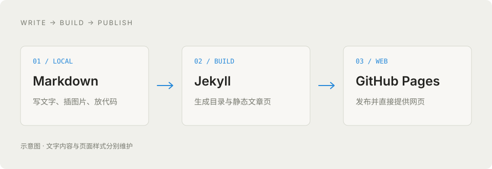

这是一篇**专门用来查看排版效果的示例文章**。你可以在网页里浏览最终效果，也可以打开同名 `.md` 文件，看每种效果是怎样写出来的。

文章中的代码、数据和任务列表都是演示内容，不代表实际测试结果或正在进行的项目。

## 目录

- [标题与段落](#headings)
- [文字样式](#text)
- [链接与引用](#links)
- [图片与图注](#images)
- [列表与任务](#lists)
- [代码](#code)
- [表格](#tables)
- [引用与分隔线](#quotes)
- [折叠内容](#details)
- [脚注与补充说明](#notes)

## 1. 标题与段落 {#headings}

文章最上面的标题由文件开头的 `title` 自动生成。正文建议从二级标题 `##` 开始，然后用三级、四级标题组织细节。

### 三级标题：一个具体话题

这是普通段落。文字会根据屏幕宽度自动换行，手机上也会保持单栏阅读。两个段落之间留一个空行，就能形成自然的阅读节奏。

如果一篇技术笔记同时包含背景、实验方法和结论，可以先用二级标题拆开，再在每个部分里用三级标题展开细节。

#### 四级标题：一个细节

标题下面可以继续写短段落、列表或代码。层级不必很多，足够表达文章结构即可。

```markdown
## 二级标题
### 三级标题
#### 四级标题

第一段正文。

第二段正文。
```

## 2. 文字样式 {#text}

你可以用 **加粗强调重点**，用 *斜体表示轻微强调*，也可以组合成 ***加粗与斜体***。

需要标记修改时，可以写 ~~已经放弃的旧方案~~；提到文件、命令或变量时，用行内代码，例如 `content/work/`、`git push` 和 `batch_size`。

少量 HTML 也可以直接使用：<mark>这是高亮文字</mark>，按键可以写成 <kbd>⌘</kbd> + <kbd>⇧</kbd> + <kbd>V</kbd>。下标与上标例如 H<sub>2</sub>O、x<sup>2</sup>。

```markdown
**加粗**
*斜体*
***加粗与斜体***
~~删除线~~
`行内代码`

<mark>高亮文字</mark>
<kbd>⌘</kbd>
H<sub>2</sub>O / x<sup>2</sup>
```

## 3. 链接与引用 {#links}

普通链接：[查看主页](../../index.html#work)。你也可以链接到 [GitHub 仓库](https://github.com/linhaifeng-nju/linhaifeng-nju.github.io)，或者阅读站内的 [写作与发布指南](../../guide.html)。

较长的文章可以使用页内链接，例如 [跳到代码示例](#code)。

重复使用的链接可以写成引用式链接：[GitHub 仓库][repository]，把地址集中放在 Markdown 文件末尾，正文会更清爽。

```markdown
[链接文字](https://example.com)
[写作指南](../../guide.html)
[跳到代码示例](#code)
[GitHub 仓库][repository]
```

## 4. 图片与图注 {#images}

下面这张图是随文章一起保存的本地 SVG 图片，用来展示图片宽度、边距和清晰度。它描绘的是这个主页的发布流程。



*图 1：写作发生在本地，网页在发布时生成；访问时直接加载静态文件。*

```markdown


*图 1：这里写图片说明。*
```

图片放在仓库的 `images/` 文件夹。对于 `content/work/` 和 `content/life/` 里的文章，`../../images/文件名` 既能用于本地预览，也能用于发布后的网页。

如果需要更正式的图注、固定尺寸或可点击的大图，可以使用 HTML：

<figure>
  <a href="../../images/work-example-pipeline.svg">
    
  </a>
  <figcaption>图 2：HTML figure 示例。点击图片可以打开独立的图片文件。</figcaption>
</figure>

```html
<figure>
  <a href="../../images/work-example-pipeline.svg">
    
  </a>
  <figcaption>图片说明。</figcaption>
</figure>
```

## 5. 列表与任务 {#lists}

### 无序列表

- 背景：说明为什么记录这个问题。
- 方法：描述用到的工具与步骤。
- 结果：给出观察、图表或代码。
  - 哪些内容已经验证。
  - 哪些内容还需要进一步确认。
- 后续：留下下一步的想法。

### 有序列表

1. 复制文章模板。
2. 修改标题、日期和摘要。
3. 用 Markdown 写正文并检查图片。
4. 提交并推送到 GitHub。

### 任务列表

- [x] 添加标题、日期和摘要。
- [x] 插入一张示例图片。
- [x] 加入代码与表格。
- [ ] 把演示内容换成自己的工作记录。

这是静态任务列表，网页中的勾选状态由 `.md` 文件决定。

```markdown
- 普通列表项
  - 嵌套列表项

1. 第一步
2. 第二步

- [x] 已完成
- [ ] 待完成
```

## 6. 代码 {#code}

### Python：计算简单统计量

标明代码语言后，发布时会生成语法高亮。

```python
from statistics import mean


def summarize(samples_ms: list[float]) -> dict[str, float]:
    """汇总演示数据，单位为毫秒。"""
    if not samples_ms:
        raise ValueError("samples_ms cannot be empty")

    return {
        "mean_ms": round(mean(samples_ms), 2),
        "min_ms": min(samples_ms),
        "max_ms": max(samples_ms),
    }


# 下面是虚构的演示数据。
print(summarize([12.4, 11.8, 13.1, 12.0]))
```

### Shell：本地预览

```bash
# 在仓库目录中运行，需要先准备 Ruby 和 Bundler。
bundle install
bundle exec jekyll serve --host 127.0.0.1
```

### JSON：结构化内容

```json
{
  "category": "work",
  "title": "一篇工作记录",
  "tags": ["notes", "example"],
  "published": true
}
```

### 纯文本与长行

没有语言的代码块适合放目录、日志和输出。长行会在代码块内部横向滚动，而不会把整篇文章撑宽。

```text
content/
├── work/
│   └── markdown-example.md
└── life/
    └── your-next-note.md

images/
└── work-example-pipeline.svg
```

```text
2026-09-30 10:00:00 INFO example_only=true category=work status=ready message="This deliberately long log line demonstrates horizontal scrolling inside a code block without expanding the article layout."
```

## 7. 表格 {#tables}

下面的数字**全部是虚构的排版演示数据**，不用于性能比较。

| 方案 | 并发数 | 延迟（ms） | 状态 |
| :--- | ---: | ---: | :---: |
| 示例 A | 1 | 12.4 | 已记录 |
| 示例 B | 4 | 18.7 | 已记录 |
| 示例 C | 8 | 25.2 | 待复查 |

```markdown
| 方案 | 并发数 | 延迟（ms） | 状态 |
| :--- | ---: | ---: | :---: |
| 示例 A | 1 | 12.4 | 已记录 |
| 示例 B | 4 | 18.7 | 已记录 |
```

表格可以放行内代码、**加粗**和 [链接](../../guide.html)。列很多时，手机上可以在表格内部横向滑动。

## 8. 引用与分隔线 {#quotes}

> 纵有疾风起，人生不言弃。
>
> 引用块也适合记录一段原始描述、阅读摘录，或者需要突出的一条观察。

引用块里也可以有结构：

> **观察**：文章的文字与表现形式可以分开维护。
>
> - Markdown 保存内容。
> - CSS 控制排版。
> - Jekyll 负责生成网页。

下面是一条分隔线，可以用来隔开两个不同的话题。

---

```markdown
> 一段引用。
>
> **引用中的重点。**

---
```

## 9. 折叠内容 {#details}

较长的日志、补充背景和非必读信息，可以放进折叠区。点击下面的标题即可展开。

<details>
  <summary>展开：一段补充说明</summary>
  <p>这里是默认收起的内容。普通 Markdown 负责大部分写作，少量 HTML 可以补充交互与排版。</p>
  <p><strong>这是 HTML 内的加粗文字。</strong> 折叠区域适合放额外解释，正文里的关键结论仍建议直接展示。</p>
</details>

```html
<details>
  <summary>点击展开</summary>
  <p>这里写补充内容。</p>
</details>
```

## 10. 脚注与补充说明 {#notes}

有些说明放在正文里会打断阅读，可以使用脚注。比如：这篇文章的示例数据只用于展示表格和代码样式。[^demo]

网页会把脚注放在文章末尾，并提供往返正文的链接。

```markdown
正文中的一句话。[^demo]

[^demo]: 这里是脚注内容。
```

### 当前示例的边界

这篇文章展示的是现在已经配置的 Markdown 与少量 HTML 功能。数学公式和 Mermaid 图还没有接入专用渲染器，暂时不会自动显示成公式或图形。

你可以把这篇文章当作格式参考，也可以删去所有演示说明，把结构改成自己的工作笔记。

[repository]: https://github.com/linhaifeng-nju/linhaifeng-nju.github.io

[^demo]: 所有延迟、并发数和代码输出示例均为演示内容，不代表真实系统的测量结果。
